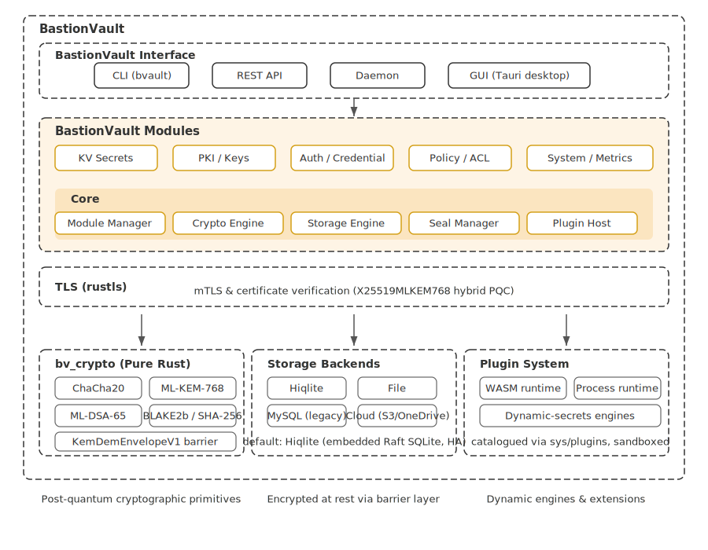

# BastionVault Design

As per: [BastionVault Requirements Document](./req.md). In this document we describe the architecture of BastionVault.

# Architecture Diagram

Detailed description:

1. BastionVault contains three main components: BastionVault Core, BastionVault Modules and BastionVault Interface.
  * BastionVault Core, the core component of BastionVault, contains several managers. Each manager is in charge of a specific mechanism or layer. For instance, the Module Manager handles all module management in BastionVault, providing mechanisms such as module loading and unloading; the Crypto Engine provides an abstract layer for cryptographic operations using the post-quantum `bv_crypto` crate; the Storage Engine abstracts over physical backends through the barrier; the Seal Manager owns the unseal-key Shamir shares and barrier state; and the **Plugin Host** brokers calls between modules and externally loaded plugins.
  * BastionVault Modules, which consists of several modules, is where the real features of BastionVault take place. Most functionality code sits in BastionVault Modules. For instance, the KV Module provides secure key-value secret storage; the PKI Module provides post-quantum key management endpoints for ML-KEM-768 and ML-DSA-65 operations.
  * BastionVault Interface is the part that interacts with end users. It exposes BastionVault through four surfaces: the **`bvault` CLI**, the **REST API** (HTTP/HTTPS via `rustls`, HashiCorp-Vault-compatible), the long-running **server daemon** that hosts both, and the **Tauri desktop GUI**. The GUI can either talk to a remote BastionVault server over the REST API or embed an in-process vault core for a fully local "single-binary" deployment. After the server receives an API request, it routes it to the corresponding BastionVault Module, which processes the request and responds to the caller.

2. BastionVault uses a post-quantum-ready cryptographic stack built on pure Rust libraries. The `bv_crypto` crate provides `ChaCha20-Poly1305` for payload encryption, `ML-KEM-768` for key establishment, and `ML-DSA-65` for post-quantum signatures. TLS is handled by `rustls` with the `aws-lc-rs` provider and the `X25519MLKEM768` hybrid key-exchange group, so vault ↔ client traffic is PQC-protected in transit.

3. BastionVault is designed to support cryptographic hardware such as HSMs or cryptography cards in the future. The modular crypto layer makes it possible to integrate hardware-backed key operations.

4. The sensitive data in BastionVault (secrets, credentials, passwords, keys) can be stored in the default embedded Hiqlite backend (Raft-replicated SQLite with HA), in local encrypted file storage, in cloud object stores (S3, OneDrive, Google Drive, Dropbox — barrier-encrypted ciphertext only) via the Cloud Storage Targets for the file backend, or — as an opt-in legacy option — in MySQL (`--features storage_mysql`). The Storage Engine in BastionVault Core abstracts over different storage backends, so other modules do not need to deal with storage differences directly.

5. **Plugin System.** BastionVault supports two plugin runtimes, both catalogued through `sys/plugins` and sandboxed away from the host process:
  * **WASM runtime** (`wasmtime`-based) for pure-Rust logic plugins that have no native I/O needs — e.g. the reference `bastion-plugin-totp` port of the TOTP secret engine. WASM plugins run in-process under fuel-metered, capability-scoped sandboxes.
  * **Process runtime** for plugins that need native sockets or vendor SDKs that don't yet run in WASI — primarily the **dynamic-secrets engines** (Postgres / MySQL / MSSQL / MongoDB / Redis / AWS / GCP / Azure / SSH dynamic-keys). These ship as separate binaries under `dynamic-engine-plugins/` so the host stays small and operators only pay the binary cost of the engines they actually mount.
  Lease, renew and revoke are routed through the host's existing lease manager regardless of runtime, so a plugin-issued credential behaves identically to a built-in one.

6. **Desktop GUI.** The Tauri desktop app is a first-class interface, not a thin REST wrapper. It can host multiple saved vaults side-by-side (Local file, Local Hiqlite, Remote BastionVault server, Cloud-backed), each with its own unseal key and root token managed by the two-layer keystore described below. In embedded mode, the GUI's Tauri backend boots an in-process `Core` (same crate as the server) instead of contacting a remote endpoint — useful for laptop-local workflows, training, and offline use.

## Desktop GUI key management

The Tauri desktop app — which can host multiple saved vaults (Local / Remote / Cloud) side-by-side — uses a two-layer keystore on top of the OS keychain rather than storing per-vault unseal keys directly:

1. **Local key** — a single 32-byte symmetric key per installation, held in the OS keychain under service `bastion-vault-gui` / entry `local-master-key`. Generated on first launch if absent. This is the ONLY credential the keychain holds for BastionVault.

2. **Encrypted vault-keys file** at `<data_local>/.bastion_vault_gui/vault-keys.enc`. A `ChaCha20-Poly1305` AEAD envelope over a JSON map `{ vault_id → { unseal_key_hex, root_token, created_at } }`. The nonce is 12 random bytes prepended to the ciphertext; a 4-byte magic header (`BVK\x01`) versions the format. Atomic write via tmp-then-rename survives crashes mid-write.

The earlier single-slot design stored only the most recently initialised vault's key under a fixed `unseal-key` keychain entry, which meant initialising or opening a second vault silently overwrote the first one's key and turned subsequent switches back into "unseal failed" errors. The two-layer model indexes every per-vault record by vault id inside the encrypted file, so adding a second vault never touches the first one's entry.

The v2 file format wraps the plaintext in an **ML-KEM-768 KEM/DEM envelope** — the Local Key is an HKDF input for a deterministic ML-KEM seed, the file stores one KEM ciphertext per registered unlock slot, and a fresh 32-byte content key protects the payload under ChaCha20-Poly1305. **YubiKey failsafe slots** (`gui/src-tauri/src/yubikey_bridge.rs`) extend the unlock-slot list: each enrolled card signs a per-slot salt with its PIV slot-9a key, and the signature seeds its own ML-KEM keypair so any one registered card can recover the file. See [Security Structure](./security-structure.md) for the full threat model, envelope diagram, and registration flow.

The legacy `unseal-key` / `root-token` keychain slots are still read on first launch after upgrade; values are migrated into the new file under the `last_used_id` profile and the legacy slots are wiped. Migration is idempotent and runs from every `get_*` call so out-of-order upgrades converge.
