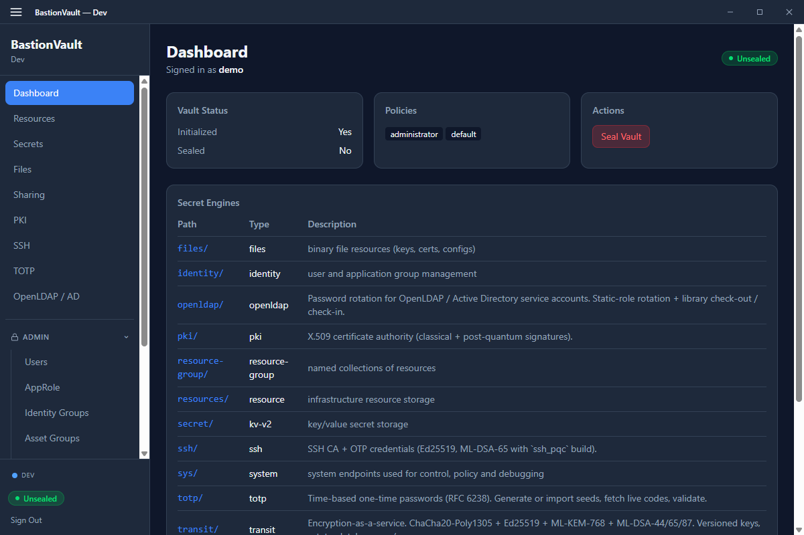
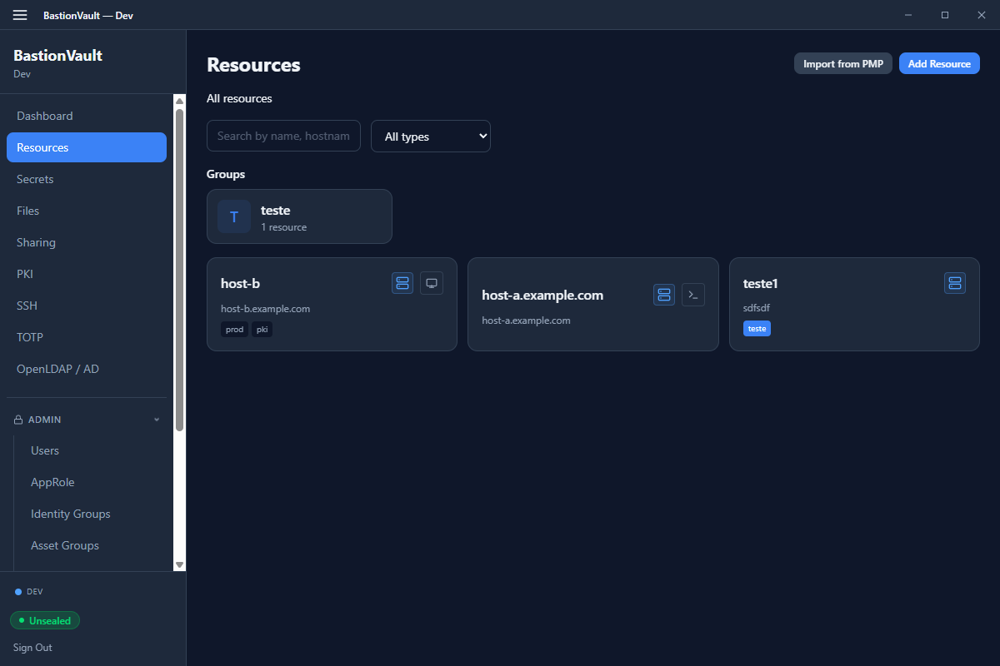
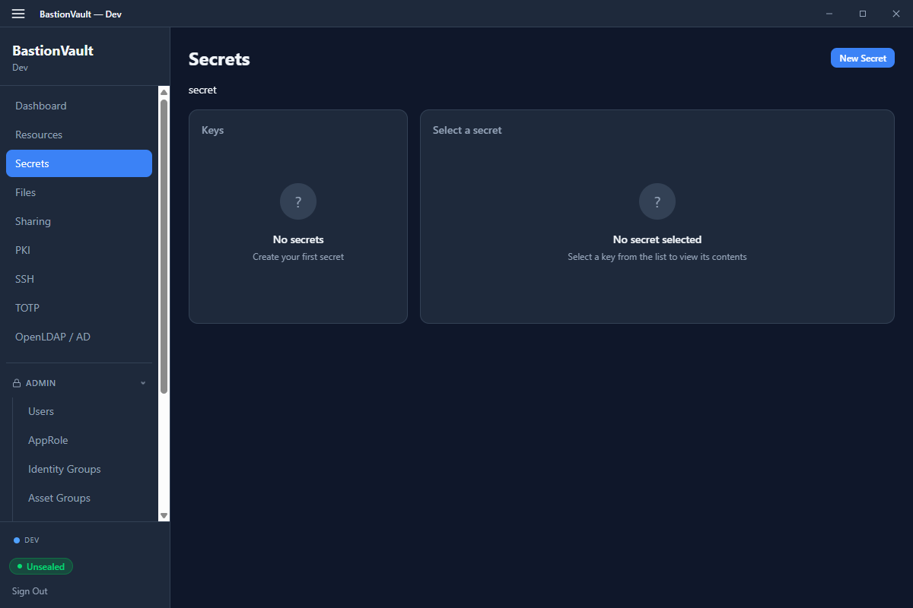
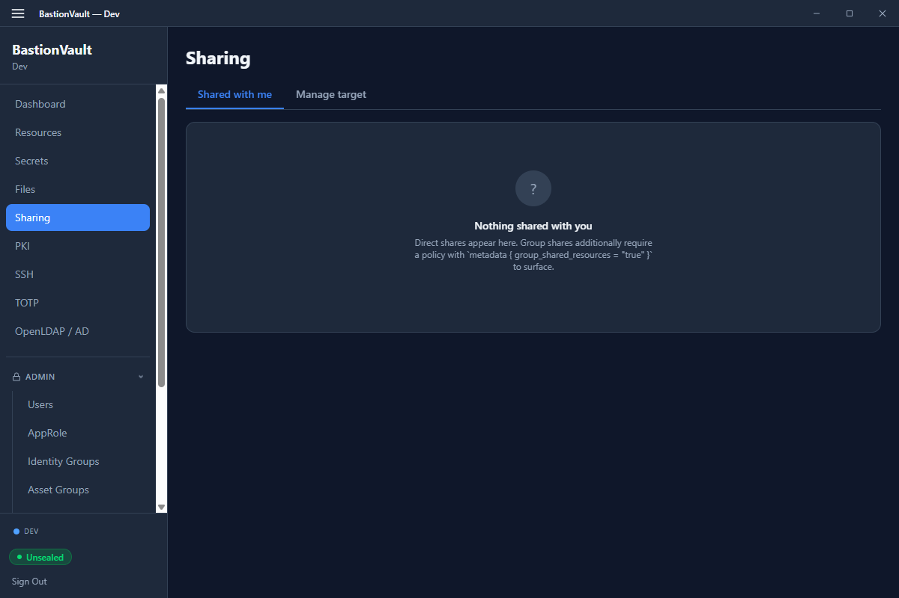
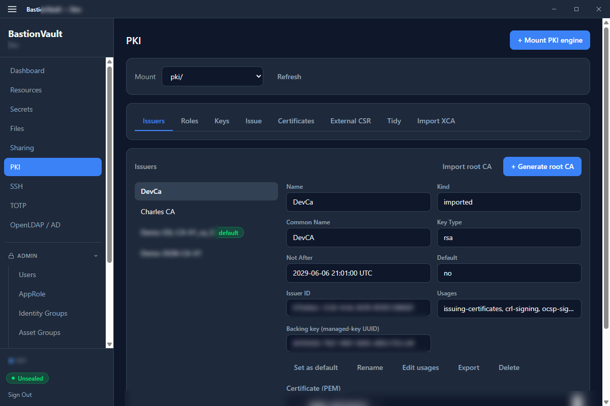

# BastionVault Desktop GUI

A Tauri v2 + React desktop application that wraps the full BastionVault feature set in a native window. The same binary connects to either an **embedded** local vault (no separate server process) or a **remote** server over HTTP/HTTPS — choice is made on the Connect screen.

- **Stack** — Tauri v2, React 19, TypeScript, Tailwind CSS 4
- **Modes** — `Local` (embedded vault, file or Hiqlite storage) and `Remote` (talks to any BastionVault HTTP listener)
- **Build targets** — Windows, macOS, Linux (single binary per platform)
- **Source** — `gui/` (frontend) and `gui/src-tauri/` (Tauri host)

The screenshots below were captured against a remote DEV vault with a `pki-user`-scoped userpass identity, so policy-gated entries (admin section, asset-group management) are intentionally hidden.

## Connect & sign in

The Connect screen is the first surface after launch. It owns:

- A profile chooser for previously-used remote vaults (address, name, last-seen node).
- A toggle to start (or resume) the **embedded** local vault — file storage for quick scratch use, Hiqlite when started via `make run-dev-gui-hiqlite`.
- The sign-in form, which adapts to the auth backends advertised by the target vault: userpass, AppID, client certificate, and FIDO2/WebAuthn.

When a remote target is part of an HA cluster, the GUI runs the same client-side node discovery the CLI uses and pins the lowest-RTT healthy node — the dot in the bottom-left of the sidebar (LOCAL/REMOTE) shows the discovered target on hover.

## Workspace navigation

The sidebar is split into two halves: a top **workspace** pane (always visible to authenticated users, individual entries gated by policy + mount type) and a collapsible **Admin** section that only appears when the caller carries one of the admin-class policies (`root`, `super-admin`, `administrator`, `admin`, or one of the delegated `*-admin` baselines such as `plugin-admin`).

Each workspace entry is double-gated:

- A **policy** check — at least one of the entry's `requires` policies must be in the caller's effective set.
- A **mount-type** check — the engine that backs the entry (e.g. `pki`, `kv-v2`, `resource`, `files`) must be mounted somewhere on the vault. Without the mount, the link is hidden so operators don't land on a dead page.

### Dashboard

The landing page after sign-in. Shows the vault's seal/init state, storage backend, server version (`/v1/sys/info`), uptime, and the connection mode (Local vs Remote). It's intentionally read-only — the goal is a fast "am I talking to the right vault?" gut-check before any sensitive operation.

### Resources

The Resources page is the operator-facing inventory of infrastructure: hosts, databases, network devices, custom resource types. Each resource carries:

- **Metadata** — name, hostname, OS type, tags, free-form notes.
- **Secrets** — versioned key/value pairs stored per-resource (separate barrier-encrypted storage, not the shared KV mount).
- **Files** — when the `files` engine is mounted, attach binary blobs (CA bundles, dotenv files, license keys) that ride the same ownership/share rules as the parent resource.
- **Connection profile** — protocol (SSH, RDP, etc.), default port, credential source, and the launch buttons that drop you into a session pane.
- **Sharing** — direct entity shares, group shares, asset-group membership.
- **History** — append-only audit log of every metadata change with the actor and the field-level diff.

Filters at the top of the list let you scope by resource type, asset group, or free-text search. The "Import from PMP" button surfaces the PMP migration helper (see `features/pmp-import.md`).

> **Visibility note.** The Resources list is filtered server-side to entries the caller **owns** (authored) or has been **shared** on. With the per-user-scoping baseline (`standard-user` policy in 0.5.22+), a userpass identity will not see resources owned by another user unless an explicit share or asset-group share is in place.

### Secrets (KV v2)

The Secrets page is the KV-v2 browser. The empty-state in the screenshot reflects a fresh `pki-user`-scoped session — nothing is visible because nothing has been authored or shared with the caller.

Once secrets exist, the page lets you:

- Browse the path tree under the `secret/` mount.
- Read the current version, write a new version, soft-delete a specific version, destroy permanently.
- View the version history and revert.
- Share an individual secret with an entity or identity group (entry surfaces on the recipient's "Shared with me" tab — see below).
- Edit metadata (max versions, `cas_required`, custom tags).

### Sharing

A two-tab feed:

- **Shared with me** — every active `SecretShare` whose grantee resolves to the caller. The default endpoint returns direct entity shares; group shares are added when the caller's policy carries `metadata.group_shared_resources = "true"` (opt-in, see [features/identity-groups.md](https://github.com/ffquintella/BastionVault/blob/main/features/identity-groups.md)).
- **Manage target** — pick a target you own (or that an admin has scoped you onto), inspect its outstanding shares, and add/revoke grants with optional expiry timestamps.

Each row shows the share `Via` (direct, group_user, group_app, asset-group), the target `Kind` (resource, kv-secret, file, asset-group), and an `Open` link that jumps to the underlying object.

### PKI

Surfaces every mounted PKI engine (selectable via the **Mount** dropdown). The page is organized by tabs:

- **Issuers** — list, rename, set default, configure usages, delete. Generate root or sign intermediate CSRs (RSA, ECDSA, Ed25519, ML-DSA-44/65/87 for PQC).
- **Roles** — define issuance constraints (allowed domains, TTLs, key algorithms, SAN policies).
- **Keys** — manage stored key material; import via PEM or PKCS#12; delete with `--force` when there are bound issuers.
- **Issue** — interactive certificate-issuance form using one of the roles, returns the chain + private key (when applicable).
- **Certs** — every certificate the engine has issued, with serial, common name, NotAfter, and revocation status.
- **CSR** — sign-verbatim and sign-with-role flows.
- **Tidy** — manual and scheduled CRL/certificate cleanup. Auto-tidy schedule editing lives here.
- **XCA** — XCA-compatible import/export.

The page automatically hides when the caller has no `pki/*` access. Listing the PKI mounts uses `sys/internal/ui/mounts` (auth-filtered), so a `pki-user` token sees only the mounts it can actually operate on — no `sys/mounts` read required.

### SSH, TOTP, OpenLDAP/AD, Cert Lifecycle

Each is the GUI surface for its respective secret engine, visible when the matching mount exists and the caller carries the engine's `*-user` or `*-admin` policy. See the dedicated feature docs for the operator semantics (`features/ssh-secret-engine.md`, `features/totp-secret-engine.md`, `features/openldap-secret-engine.md`, `features/cert-lifecycle.md`).

## Admin section

Visible to tokens with `root`, `super-admin`, `administrator`, `admin`, or a delegated `*-admin` baseline. Each entry is independently policy-gated, so a `plugin-admin` token only sees the **Plugins** link, an `exchange-admin` token only sees **Import / Export**, and so on.

| Entry | Purpose |
|-------|---------|
| Users | Userpass user lifecycle: create / update password / set policies / register FIDO2 keys |
| AppID | AppID role lifecycle and secret-id generation |
| Identity Groups | User / app groups, with the policies that group members inherit |
| Asset Groups | Named bundles of resources and KV paths that can be shared as a unit |
| Policies | View, edit, and create HCL policies; surfaces seeded baselines (default, standard-user, secret-author, pki-user, …) |
| Mounts | Browse and unmount secret/auth engines (mount creation lives next to each engine's own page) |
| Audit | Live tail of the audit log with category filters (auth, user lifecycle, policy, share, etc.) |
| Plugins | Plugin Extensibility v1: registry view, activation, surface bundle browser |
| Import / Export | BVBK backup/restore, scheduled exports, KV/cluster migrations |
| Settings | Server-wide configuration knobs (cache, telemetry, FIDO2 RP, SSO) |

## Backup & restore

Triggered from the title-bar hamburger menu (top-left of the window) regardless of which page is active. Backups use the BVBK binary format with HMAC-SHA256 integrity; restore walks a multi-step wizard that validates the bundle, lists impacted mounts, and surfaces a dry-run summary before writing.

## Server info

The title-bar **Server → Server Info...** entry opens a modal that hits `GET /v1/sys/info` (proxied in remote mode, read in-process for the embedded vault). It shows the connection kind, endpoint, server version, sealed/initialized badges, storage backend, start time, and human-formatted uptime — useful when debugging "which build is running on that host?".

## Hardware-key auth (FIDO2 / YubiKey)

The GUI ships native FIDO2 support — the **Register Security Key** button on the user-edit dialog drives a CTAP2 round-trip directly from the desktop, no browser required. Once a credential is enrolled, the caller can switch to passwordless login on the Connect screen.

YubiKey is also recognised at vault-init time: when initialising an embedded vault the GUI can wrap an unseal share to a YubiKey slot, persisting only the metadata pointer in `localStorage` (`bv.init.yubikey.*`) so subsequent unseals can be one-touch.

## Running the GUI in development

| Command | What it builds |
|---------|----------------|
| `make run-dev-gui` | Default dev build with embedded Hiqlite + SSH PQC + the MCP bridge feature flag |
| `make run-dev-gui-hiqlite` | Embedded Hiqlite vault, ports 8210 / 8220, no MCP bridge |
| `make run-dev-gui-only` | Lightest compile — no storage features, MCP bridge enabled, talks to an external server via the Connect page |
| `make gui-build` | Production bundle for the current OS |
| `make gui-test` | Vitest UI suite |

For automation and screenshot capture (this page used it), the MCP bridge plugin must be enabled. It's gated on `cfg(debug_assertions)`, `feature = "mcp_local_dev"`, and `BASTION_TAURI_MCP=1` — production binaries never expose the bridge. Setup requires `withGlobalTauri: true` in `tauri.conf.json` and the `mcp-bridge:default` permission in `capabilities/default.json` (both already wired in this repo).
