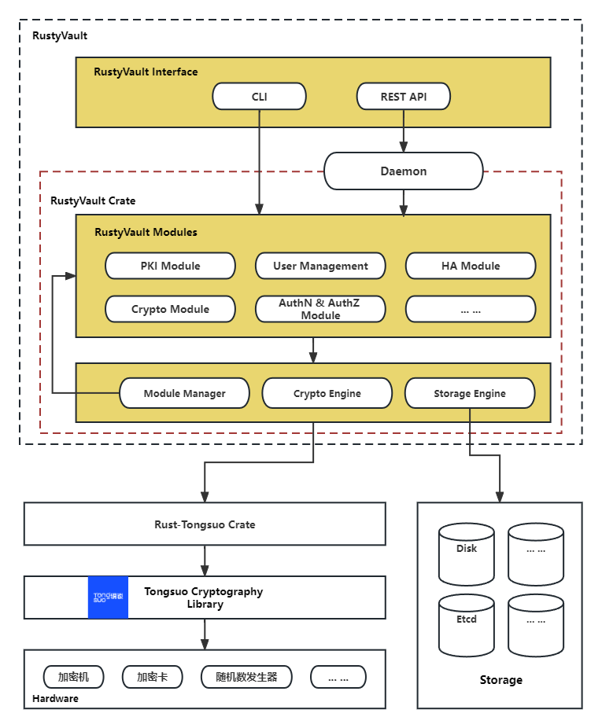

# BastionVault Design

根据：[BastionVault需求文档](./req.md)中的整体需求点，进行功能细化。本文档对BastionVault的整体架构进行描述。

# 结构图

说明如下：

1. 虚线框中为BastionVault，其整体上分为三大部分：BastionVault Core, BastionVault Modules和BastionVault Surface.
  * BastionVault Core，此组件是BastionVault的核心组件，由多个Manager组成，不同的Manager分管不同功能。例如Module Manager负责对BastionVault的各个功能模块进行管理，提供模块的热插拔等机制；Crypto Manager则对接底层密码库（铜锁），通过rust-tongsuo的Rust binding来调用铜锁的C API实现各种密码学功能等；
  * BastionVault Modules，此部分由多个Module组成，是BastionVault的实际执行各种功能的环节，即BastionVault的实际功能代码都位于此。例如，PKI Module提供了完整的PKI能力，如扮演CA进行X.509证书的签发、吊销等管理工作；Crypto Module则依赖于BastionVault Core中的Crypto Manager对底层密码学原语进行调用，以实现对外提供诸如加密解密、签名验签等功能；
  * BastionVault Surface，此组件是直接和最终用户打交道的部分，对外提供HTTPS接入能力，并对API请求进行解析后，转发给某个实际功能的Module上，由该Module进行处理后，返回处理结果给用户。此外，此组件还负责整体的配置解析等工作。

2. BastionVault需要依赖于底层的密码学算法库（也可称之为软件密码模块），由底层密码库提供全部的密码学相关功能。BastionVault默认的底层密码库是铜锁。

3. 密码硬件，如加密机、加密卡等，的使用对BastionVault是透明的，该过程由铜锁屏蔽，因此BastionVault对于硬件的差异和对接是无感的。

4. BastionVault中的敏感安全参数（如各种密钥、随机数、认证信息等）中存在持久化存储需求的，可以在本地加密存储，或者连接外部存储（如etcd）。连接外部存储对于创建BastionVault集群是必须的。存储方面的管理由BastionVault Core中的Storage Manager负责，BastionVault的其他组件也无需感知不同存储方式之间的使用差异。
