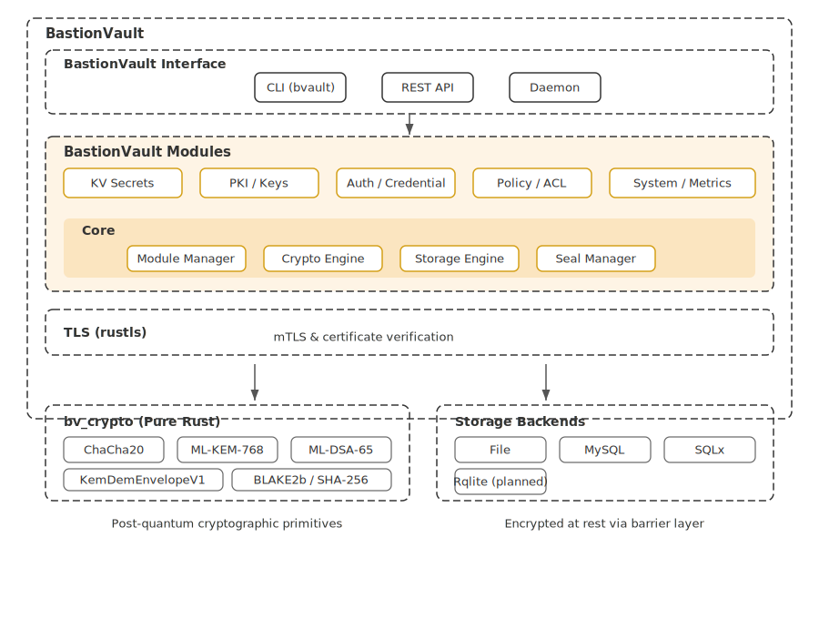

# BastionVault Design

As per: [BastionVault Requirements Document](./req.md). In this document we describe the architecture of BastionVault.

# Architecture Diagram

Detailed description:

1. BastionVault contains three main components: BastionVault Core, BastionVault Modules and BastionVault Interface.
  * BastionVault Core, the core component of BastionVault, contains several managers. Each manager is in charge of a specific mechanism or layer. For instance, the Module Manager handles all module management in BastionVault, providing mechanisms such as module loading and unloading. The Crypto Manager provides an abstract layer for cryptographic operations using the post-quantum `bv_crypto` crate.
  * BastionVault Modules, which consists of several modules, is where the real features of BastionVault take place. Most functionality code sits in BastionVault Modules. For instance, the KV Module provides secure key-value secret storage; the PKI Module provides post-quantum key management endpoints for ML-KEM-768 and ML-DSA-65 operations.
  * BastionVault Interface is the part that interacts with end users. The BastionVault Interface provides a set of RESTful APIs via an HTTP/HTTPS server (using `rustls` for TLS). After the server receives the API requests, it routes them to the corresponding BastionVault Module. That module then processes the request and responds to the caller.

2. BastionVault uses a post-quantum-ready cryptographic stack built on pure Rust libraries. The `bv_crypto` crate provides `ChaCha20-Poly1305` for payload encryption, `ML-KEM-768` for key establishment, and `ML-DSA-65` for post-quantum signatures. TLS is handled by `rustls`.

3. BastionVault is designed to support cryptographic hardware such as HSMs or cryptography cards in the future. The modular crypto layer makes it possible to integrate hardware-backed key operations.

4. The sensitive data in BastionVault (secrets, credentials, passwords, keys) can be stored in local encrypted file storage or external database storage such as MySQL or PostgreSQL. The Storage Manager in BastionVault Core abstracts over different storage backends, so other modules do not need to deal with storage differences directly.
